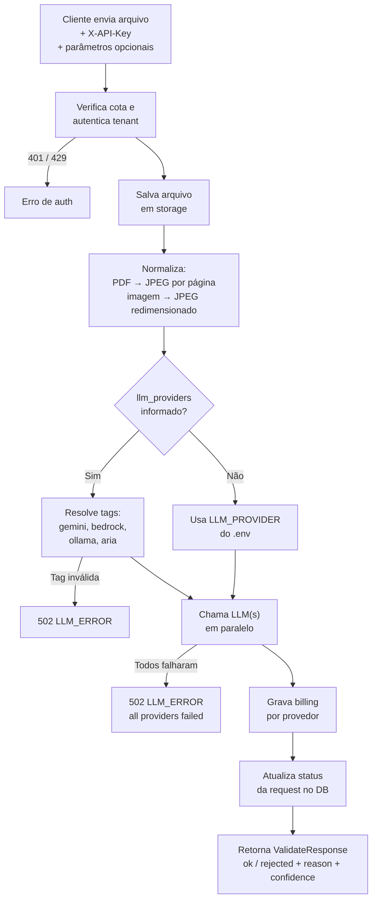

# API de Validação de Documentos — Referência

**O que é:** REST API que recebe documentos médicos (PDF ou imagem), envia para um ou mais provedores LLM e retorna se o documento é válido, com motivo e confiança.

**Base URL:** `http://localhost:8000`

**Formatos:** JSON em todos os endpoints, exceto `POST /v1/validate` que usa `multipart/form-data`.

---

## Autenticação

Existem dois tipos de chave. Você **sempre** passa uma delas via header.

| Tipo | Header | Quem usa | Onde funciona |
|---|---|---|---|
| API Key do cliente | `X-API-Key` | Sistemas integrados, clientes | `/v1/validate`, `/v1/requests/*`, `/v1/billing/*` |
| Chave admin | `X-Admin-Key` | Equipe interna | `/v1/admin/*` |

A `X-API-Key` identifica automaticamente o tenant — você não precisa passar `tenant_id` nos endpoints de cliente.

**Erros de auth que você vai ver:**

| Código HTTP | `error_code` | Causa |
|---|---|---|
| 401 | `INVALID_API_KEY` | Chave inexistente ou revogada |
| 429 | `QUOTA_EXCEEDED` | Cota diária da key atingida |
| 401 | `INVALID_ADMIN_KEY` | Admin key errada |
| 503 | `ADMIN_NOT_CONFIGURED` | `ADMIN_API_KEY` não definida no servidor |

---

## Pipeline do `POST /v1/validate`



---

## Endpoints

### Variáveis — cole isso primeiro em qualquer sessão PowerShell

```powershell
$BASE    = "http://localhost:8000"
$API_KEY = "SUA_API_KEY_AQUI"                  # preencha com sua API key de cliente
$ADMIN   = "SUA_ADMIN_KEY_AQUI"                  # preencha antes de rodar endpoints /admin
$TENANT  = "uuid-do-tenant"                       # preencha ao criar tenant
$KEY_ID  = "uuid-da-api-key"                      # preencha ao listar keys
```

---

### POST /v1/validate

Valida um documento. Principal endpoint do sistema.

**Headers obrigatórios:** `X-API-Key`

**Body:** `multipart/form-data`

| Campo | Tipo | Obrigatório | Descrição |
|---|---|---|---|
| `file` | arquivo | sim | PDF ou imagem (JPG, PNG) |
| `document_type` | string | não | `guia_internacao`, `laudo_medico`, `receita`, `pedido_exame`, `outros` |
| `regra` | string | não | Instrução extra para o LLM avaliar (texto livre) |
| `llm_providers` | string | não | Tags separadas por vírgula: `gemini`, `bedrock`, `ollama`, `aria`. Omitir = usa o padrão do servidor |

**Resposta 200:**

```json
{
  "request_id": "uuid",
  "status": "ok",
  "ok": true,
  "reason": "Documento válido com todos os campos preenchidos",
  "confidence": 0.95,
  "document_type": "laudo_medico",
  "tokens_used": { "input": 1200, "output": 80 },
  "results": null
}
```

> Quando `llm_providers` tem mais de um valor, `results` é uma lista com o resultado de cada provedor e `ok` é `true` só se **todos** aprovaram.

**Erros possíveis:**

| HTTP | `error_code` | Causa |
|---|---|---|
| 401 | `INVALID_API_KEY` | Key inválida |
| 429 | `QUOTA_EXCEEDED` | Cota diária esgotada |
| 422 | `UNSUPPORTED_FORMAT` | `document_type` inválido |
| 502 | `LLM_ERROR` | Tag de provedor inválida ou todos os LLMs falharam |
| 500 | `INTERNAL_ERROR` | Erro interno |

**PowerShell — copiar e colar:**

```powershell
# 1. Cria um PDF de teste mínimo (1 página em branco) para não precisar de arquivo real
[System.IO.File]::WriteAllBytes("$env:TEMP\teste.pdf",
  [Convert]::FromBase64String("JVBERi0xLjQKMSAwIG9iajw8L1R5cGUvQ2F0YWxvZy9QYWdlcyAyIDAgUj4+ZW5kb2JqCjIgMCBvYmo8PC9UeXBlL1BhZ2VzL0tpZHNbMyAwIFJdL0NvdW50IDE+PmVuZG9iagozIDAgb2JqPDwvVHlwZS9QYWdlL1BhcmVudCAyIDAgUi9NZWRpYUJveFswIDAgNjEyIDc5Ml0+PmVuZG9iagp4cmVmCjAgNAowMDAwMDAwMDAwIDY1NTM1IGYgCjAwMDAwMDAwMDkgMDAwMDAgbiAKMDAwMDAwMDA1OCAwMDAwMCBuIAowMDAwMDAwMTE1IDAwMDAwIG4gCnRyYWlsZXI8PC9TaXplIDQvUm9vdCAxIDAgUj4+CnN0YXJ0eHJlZgoyMTAKJSVFT0Y="))

# 2. Valida o arquivo
Invoke-RestMethod -Method POST "http://localhost:8000/v1/validate" `
  -Headers @{ "X-API-Key" = "8d6b16d1438841b7885b437e39a149d2" } `
  -Form @{
    file          = Get-Item "$env:TEMP\teste.pdf"
    document_type = "laudo_medico"
    regra         = "Verificar se há assinatura do médico e CRM visível"
  } | ConvertTo-Json -Depth 10
```


---

### GET /v1/requests/{request_id}

Busca o resultado de uma validação já processada.

**Headers obrigatórios:** `X-API-Key`

**Path:** `request_id` — UUID retornado pelo `/validate`

**Resposta 200:**

```json
{
  "request_id": "uuid",
  "status": "ok",
  "ok": true,
  "reason": "Documento válido",
  "confidence": 0.92,
  "document_type": "receita",
  "processed_at": "2026-05-14T11:00:00",
  "tokens_used": { "input": 900, "output": 60 }
}
```

**Erros:** 404 se a request não existir ou pertencer a outro tenant.

**PowerShell — copiar e colar:**

```powershell
# Substitua o UUID pelo request_id retornado no /validate
$REQ_ID = "cole-aqui-o-request_id-do-validate"

Invoke-RestMethod -Method GET "http://localhost:8000/v1/requests/$REQ_ID" `
  -Headers @{ "X-API-Key" = "8d6b16d1438841b7885b437e39a149d2" } | ConvertTo-Json -Depth 10
```


---

### GET /v1/billing/summary

Totais de consumo do tenant no período.

**Headers obrigatórios:** `X-API-Key`

**Query obrigatório:**

| Param | Tipo | Exemplo |
|---|---|---|
| `from` | datetime ISO 8601 | `2026-05-01T00:00:00` |
| `to` | datetime ISO 8601 | `2026-05-14T23:59:59` |

**Resposta 200:**

```json
{
  "tenant_id": "uuid",
  "total_requests": 342,
  "total_tokens_input": 410000,
  "total_tokens_output": 27000,
  "estimated_cost_brl": 1.234567,
  "period_from": "2026-05-01T00:00:00",
  "period_to": "2026-05-14T23:59:59"
}
```

**PowerShell — copiar e colar:**

```powershell
Invoke-RestMethod -Method GET "http://localhost:8000/v1/billing/summary" `
  -Headers @{ "X-API-Key" = "8d6b16d1438841b7885b437e39a149d2" } `
  -Body @{
    from = "2026-05-01T00:00:00"
    to   = "2026-05-14T23:59:59"
  }
```


---

### GET /v1/billing/usage

Consumo quebrado por provedor LLM e por API key.

**Headers obrigatórios:** `X-API-Key`

**Query obrigatório:** `from`, `to` (mesmo formato de `/billing/summary`)

**Resposta 200:**

```json
{
  "period_from": "...",
  "period_to": "...",
  "by_provider": [
    { "provider": "gemini", "validacoes": 200, "tokens_input": 240000, "tokens_output": 16000, "custo_total": 0.72 }
  ],
  "by_api_key": [
    { "api_key_id": "uuid", "nome_cliente": "App Integração", "owner": "Pedro", "validacoes": 200, "tokens_input": 240000, "tokens_output": 16000, "custo_total": 0.72 }
  ]
}
```

**PowerShell — copiar e colar:**


```powershell
Invoke-RestMethod -Method GET "http://localhost:8000/v1/billing/usage" `
  -Headers @{ "X-API-Key" = "8d6b16d1438841b7885b437e39a149d2" } `
  -Body @{
    from = "2026-05-01T00:00:00"
    to   = "2026-05-14T23:59:59"
  } | ConvertTo-Json -Depth 10
```

---

### GET /v1/billing/usage/detail

Linhas detalhadas de billing, uma por request processada. Ideal para exportar para Power BI.

**Headers obrigatórios:** `X-API-Key`

**Query:**

| Param | Obrigatório | Descrição |
|---|---|---|
| `from` | sim | datetime ISO 8601 |
| `to` | sim | datetime ISO 8601 |
| `api_key_id` | não | Filtrar por UUID de uma API key específica |

**Resposta 200:** lista de objetos:

```json
[
  {
    "date": "2026-05-14",
    "request_id": "uuid",
    "api_key_id": "uuid",
    "nome_cliente": "App Integração",
    "owner": "Pedro",
    "llm_provider": "gemini",
    "tokens_input": 1200,
    "tokens_output": 80,
    "custo_total": 0.0036,
    "tenant_id": "uuid"
  }
]
```

**PowerShell — copiar e colar:**

```powershell
Invoke-RestMethod -Method GET "http://localhost:8000/v1/billing/usage/detail" `
  -Headers @{ "X-API-Key" = "8d6b16d1438841b7885b437e39a149d2" } `
  -Body @{
    from = "2026-05-01T00:00:00"
    to   = "2026-05-14T23:59:59"
  } | ConvertTo-Json -Depth 10
```

---

### POST /v1/admin/api-keys

Cria uma nova API key para um tenant.

**Headers obrigatórios:** `X-Admin-Key`

**Body JSON:**

| Campo | Tipo | Obrigatório | Descrição |
|---|---|---|---|
| `tenant_id` | string (UUID) | sim | Tenant dono da key |
| `nome_cliente` | string | sim | Label identificador |
| `owner` | string | não | Nome do responsável |
| `quota_diaria` | int | não (padrão: 1000) | Máximo de validações por dia |

**Resposta 201:** igual ao `GET`, mas inclui `raw_key` — a única vez que a chave aparece em texto claro. Guarde imediatamente.

```json
{
  "id": "uuid",
  "tenant_id": "uuid",
  "nome_cliente": "App Integração",
  "owner": "Pedro",
  "quota_diaria": 1000,
  "status": "active",
  "raw_key": "vd_xxxxxxxxxxxxxxxx"
}
```

**PowerShell — copiar e colar:**

```powershell
# Preencha SUA_ADMIN_KEY e o tenant_id antes de rodar
Invoke-RestMethod -Method POST "http://localhost:8000/v1/admin/api-keys" `
  -Headers @{ "X-Admin-Key" = "SUA_ADMIN_KEY_AQUI"; "Content-Type" = "application/json" } `
  -Body (@{
    tenant_id    = "cole-aqui-o-tenant_id"
    nome_cliente = "App Integração"
    owner        = "Pedro"
    quota_diaria = 1000
  } | ConvertTo-Json) | ConvertTo-Json -Depth 10
```

---

### GET /v1/admin/api-keys

Lista todas as API keys de um tenant (sem revelar o secret).

**Headers obrigatórios:** `X-Admin-Key`

**Query obrigatório:** `tenant_id`

**PowerShell — copiar e colar:**

```powershell
Invoke-RestMethod -Method GET "http://localhost:8000/v1/admin/api-keys" `
  -Headers @{ "X-Admin-Key" = "SUA_ADMIN_KEY_AQUI" } `
  -Body @{ tenant_id = "cole-aqui-o-tenant_id" } | ConvertTo-Json -Depth 10
```

---

### PATCH /v1/admin/api-keys/{key_id}

Atualiza campos de uma API key. Envie só o que quiser mudar.

**Headers obrigatórios:** `X-Admin-Key`

**Body JSON (todos opcionais, mas ao menos um obrigatório):**

| Campo | Tipo | Valores aceitos |
|---|---|---|
| `nome_cliente` | string | qualquer |
| `owner` | string | qualquer |
| `quota_diaria` | int | >= 1 |
| `status` | string | `active` ou `revoked` |

**Erros:** 422 se body vier vazio; 404 se key não encontrada.

**PowerShell — copiar e colar:**

```powershell
# Revogar uma key — substitua o KEY_ID
Invoke-RestMethod -Method PATCH "http://localhost:8000/v1/admin/api-keys/cole-aqui-o-key_id" `
  -Headers @{ "X-Admin-Key" = "SUA_ADMIN_KEY_AQUI"; "Content-Type" = "application/json" } `
  -Body (@{ status = "revoked" } | ConvertTo-Json) | ConvertTo-Json -Depth 10

# Aumentar cota — substitua o KEY_ID
Invoke-RestMethod -Method PATCH "http://localhost:8000/v1/admin/api-keys/cole-aqui-o-key_id" `
  -Headers @{ "X-Admin-Key" = "SUA_ADMIN_KEY_AQUI"; "Content-Type" = "application/json" } `
  -Body (@{ quota_diaria = 5000 } | ConvertTo-Json) | ConvertTo-Json -Depth 10
```

---

### DELETE /v1/admin/api-keys/{key_id}

Remove uma API key permanentemente.

**Headers obrigatórios:** `X-Admin-Key`

**Query obrigatório:** `tenant_id`

**Resposta:** 204 sem body. 404 se não encontrada.

**PowerShell — copiar e colar:**

```powershell
# Substitua KEY_ID e TENANT_ID
Invoke-RestMethod -Method DELETE "http://localhost:8000/v1/admin/api-keys/cole-aqui-o-key_id?tenant_id=cole-aqui-o-tenant_id" `
  -Headers @{ "X-Admin-Key" = "SUA_ADMIN_KEY_AQUI" }
```

---

### GET /v1/admin/api-keys/quota-usage

Mostra uso da cota **do dia atual** para cada API key de um tenant.

**Headers obrigatórios:** `X-Admin-Key`

**Query obrigatório:** `tenant_id`

**Resposta 200:**

```json
[
  {
    "id": "uuid",
    "nome_cliente": "App Integração",
    "owner": "Pedro",
    "quota_diaria": 1000,
    "usado_hoje": 143,
    "pct_usado": 14.3
  }
]
```

**PowerShell — copiar e colar:**

```powershell
Invoke-RestMethod -Method GET "http://localhost:8000/v1/admin/api-keys/quota-usage" `
  -Headers @{ "X-Admin-Key" = "SUA_ADMIN_KEY_AQUI" } `
  -Body @{ tenant_id = "cole-aqui-o-tenant_id" } | ConvertTo-Json -Depth 10
```

---

### POST /v1/admin/tenants

Cria um novo tenant.

**Headers obrigatórios:** `X-Admin-Key`

**Body JSON:**

| Campo | Tipo | Obrigatório |
|---|---|---|
| `nome` | string | sim |
| `email_contato` | string | sim |
| `plano` | string | não (padrão: `basico`) |

**Resposta 201:**

```json
{
  "id": "uuid",
  "nome": "Clínica ABC",
  "plano": "basico",
  "email_contato": "ti@clinicaabc.com",
  "ativo": true
}
```

**PowerShell — copiar e colar:**

```powershell
Invoke-RestMethod -Method POST "http://localhost:8000/v1/admin/tenants" `
  -Headers @{ "X-Admin-Key" = "SUA_ADMIN_KEY_AQUI"; "Content-Type" = "application/json" } `
  -Body (@{
    nome          = "Clínica ABC"
    email_contato = "ti@clinicaabc.com"
    plano         = "basico"
  } | ConvertTo-Json) | ConvertTo-Json -Depth 10
```


---

### GET /v1/admin/tenants

Lista todos os tenants cadastrados.

**Headers obrigatórios:** `X-Admin-Key`

**PowerShell — copiar e colar:**

```powershell
Invoke-RestMethod -Method GET "http://localhost:8000/v1/admin/tenants" `
  -Headers @{ "X-Admin-Key" = "SUA_ADMIN_KEY_AQUI" } | ConvertTo-Json -Depth 10
```

---

### PATCH /v1/admin/tenants/{tenant_id}

Atualiza campos de um tenant. Envie só o que quiser mudar.

**Headers obrigatórios:** `X-Admin-Key`

**Body JSON (todos opcionais, ao menos um obrigatório):**

| Campo | Tipo |
|---|---|
| `nome` | string |
| `email_contato` | string |
| `plano` | string |
| `ativo` | boolean |

**PowerShell — copiar e colar:**

```powershell
# Desativar tenant — substitua o TENANT_ID
Invoke-RestMethod -Method PATCH "http://localhost:8000/v1/admin/tenants/cole-aqui-o-tenant_id" `
  -Headers @{ "X-Admin-Key" = "SUA_ADMIN_KEY_AQUI"; "Content-Type" = "application/json" } `
  -Body (@{ ativo = $false } | ConvertTo-Json) | ConvertTo-Json -Depth 10
```

---

### GET /v1/admin/billing/summary

Mesmo que `/v1/billing/summary`, mas para qualquer tenant — acesso admin.

**Headers obrigatórios:** `X-Admin-Key`

**Query obrigatório:** `tenant_id`, `from`, `to`

**PowerShell — copiar e colar:**

```powershell
Invoke-RestMethod -Method GET "http://localhost:8000/v1/admin/billing/summary" `
  -Headers @{ "X-Admin-Key" = "SUA_ADMIN_KEY_AQUI" } `
  -Body @{
    tenant_id = "cole-aqui-o-tenant_id"
    from      = "2026-05-01T00:00:00"
    to        = "2026-05-14T23:59:59"
  } | ConvertTo-Json -Depth 10
```

---

### GET /v1/admin/billing/usage

Consumo por provedor e por API key de um tenant específico.

**Headers obrigatórios:** `X-Admin-Key`

**Query obrigatório:** `tenant_id`, `from`, `to`

**PowerShell — copiar e colar:**

```powershell
Invoke-RestMethod -Method GET "http://localhost:8000/v1/admin/billing/usage" `
  -Headers @{ "X-Admin-Key" = "SUA_ADMIN_KEY_AQUI" } `
  -Body @{
    tenant_id = "cole-aqui-o-tenant_id"
    from      = "2026-05-01T00:00:00"
    to        = "2026-05-14T23:59:59"
  } | ConvertTo-Json -Depth 10
```

---

### GET /v1/admin/billing/usage/detail

Linhas detalhadas de billing para um tenant específico.

**Headers obrigatórios:** `X-Admin-Key`

**Query:** `tenant_id` (obrigatório), `from` (obrigatório), `to` (obrigatório), `api_key_id` (opcional)

**PowerShell — copiar e colar:**

```powershell
Invoke-RestMethod -Method GET "http://localhost:8000/v1/admin/billing/usage/detail" `
  -Headers @{ "X-Admin-Key" = "SUA_ADMIN_KEY_AQUI" } `
  -Body @{
    tenant_id = "cole-aqui-o-tenant_id"
    from      = "2026-05-01T00:00:00"
    to        = "2026-05-14T23:59:59"
  } | ConvertTo-Json -Depth 10
```

---

### GET /v1/admin/billing/usage/all-tenants

Consumo agregado por tenant — visão geral de todos os clientes.

**Headers obrigatórios:** `X-Admin-Key`

**Query obrigatório:** `from`, `to`

**Resposta 200:**

```json
[
  {
    "tenant_id": "uuid",
    "nome": "Clínica ABC",
    "plano": "basico",
    "validacoes": 342,
    "tokens_input": 410000,
    "tokens_output": 27000,
    "custo_total": 1.23
  }
]
```

**PowerShell — copiar e colar:**

```powershell
Invoke-RestMethod -Method GET "http://localhost:8000/v1/admin/billing/usage/all-tenants" `
  -Headers @{ "X-Admin-Key" = "SUA_ADMIN_KEY_AQUI" } `
  -Body @{
    from = "2026-05-01T00:00:00"
    to   = "2026-05-14T23:59:59"
  } | ConvertTo-Json -Depth 10
```

---

### GET /health

Retorna `{"status": "ok"}`. Use para checar se o servidor está de pé.

**PowerShell — copiar e colar:**

```powershell
Invoke-RestMethod -Method GET "http://localhost:8000/health" | ConvertTo-Json -Depth 10
```

---

### GET /metrics

Retorna status do banco de dados + versão do serviço.

**Resposta 200:**

```json
{
  "database": "up",
  "service": "validacao-documentos",
  "version": "1.0.0"
}
```

**PowerShell — copiar e colar:**

```powershell
Invoke-RestMethod -Method GET "http://localhost:8000/metrics" | ConvertTo-Json -Depth 10
```

---

## Tabela de erros globais

| HTTP | `error_code` | Quando acontece |
|---|---|---|
| 401 | `INVALID_API_KEY` | `X-API-Key` inválida ou revogada |
| 401 | `INVALID_ADMIN_KEY` | `X-Admin-Key` errada |
| 404 | `NOT_FOUND` | Recurso não existe ou pertence a outro tenant |
| 422 | `UNSUPPORTED_FORMAT` | `document_type` fora da lista aceita |
| 422 | — | Body ou query inválido (FastAPI valida automaticamente) |
| 429 | `QUOTA_EXCEEDED` | Cota diária da API key esgotada |
| 500 | `INTERNAL_ERROR` | Erro interno não tratado |
| 502 | `LLM_ERROR` | Provedor LLM inválido ou todos os LLMs falharam |
| 503 | `ADMIN_NOT_CONFIGURED` | `ADMIN_API_KEY` não definida no `.env` |

**Formato padrão de erro:**

```json
{
  "request_id": "uuid",
  "status": "error",
  "error_code": "QUOTA_EXCEEDED",
  "message": "Cota diária atingida"
}
```

---

## Variáveis de ambiente que afetam o comportamento da API

| Variável | Padrão | O que controla |
|---|---|---|
| `LLM_PROVIDER` | `gemini` | Provedor usado quando `llm_providers` não é informado no request |
| `MAX_CONCURRENT_REQUESTS` | `200` | Quantas validações simultâneas o servidor aceita antes de enfileirar |
| `LLM_TIMEOUT_SECONDS` | `60` | Timeout por chamada ao LLM |
| `MAX_TOKENS_INPUT` | `100000` | Limite de tokens enviados por request ao LLM |
| `PDF_RENDER_DPI` | `120` | Resolução de renderização do PDF (maior = mais detalhe, mais lento) |
| `NORMALIZE_MAX_LONG_EDGE` | `2048` | Dimensão máxima da imagem enviada ao LLM (px) |
| `LLM_JPEG_QUALITY` | `85` | Qualidade JPEG das imagens enviadas (40–100) |
